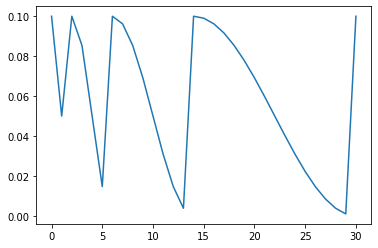
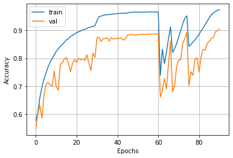

# ResNet for cifar10
The training started with learning rate(LR) 1e-2 and decay it by 0.1 at 30, 45, 55 epoch because the model(ResNet20) experienced severe gradient exploding with original LR(1e-1). The rest of hyperparameter and data augmentation is same with original ResNet study. After 60 epochs, I trained the model with SGDWR for 30 epochs with LR 1e-1.

The study SGDR discribed that the model's best performence can be achieved at the lowest LR.

This model's test accuracy was 0.9052, which gets slightly behinde with original paper(0.9125), however it's evident that the performence of the model will be improved if the model is trained 30 epochs more.

### callbacks.py
* Learning rate scheduler(fixed, cosine annealing decay)
* Decoupled L2 regularizer

### conifg.py
* Configuring hyperparameters and model architectue

### main.py

### model.py
* Containing model architecture
* Building a model
* Initiating training

### pipeline.py
* Building data loading pipeline
* Downloading cifar10 dataset from tf.keras.dataset
* Spliting dataset into train and validation
* Augmenting dataset
